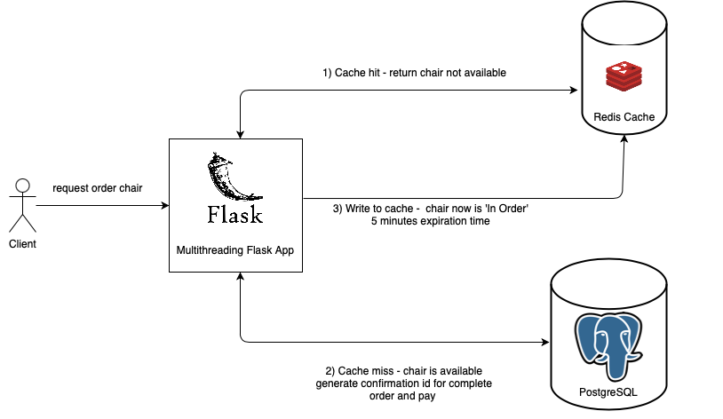
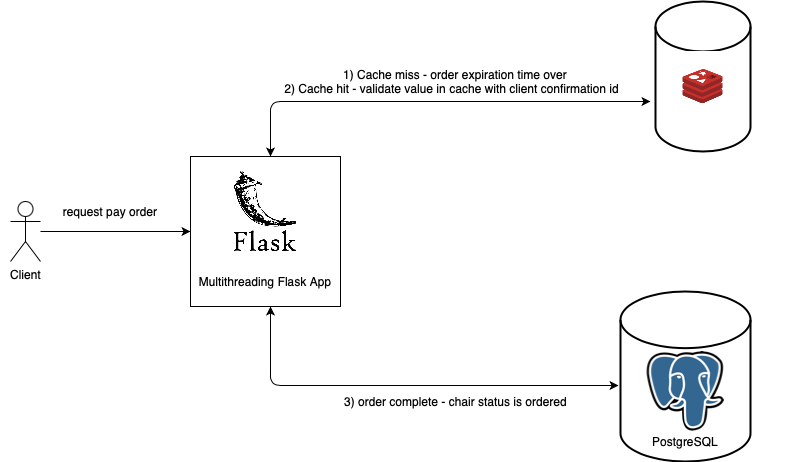

# Movie Theater Management System
## Table of contents
* [General info](#general-info)
* [Stages](#stages)
* [Description](#description)
* [Setup](#setup)

## General info
This project implement Movie Theater Management System RESTful API using Flask, PostgreSQL and Redis. The system allows ordering chairs for the theater while maintaining the ability to take multiple orders simultaneously and the fact that specific chair can not be ordered for 2 different customers.

## Stages
The system is divided into 3 stages:

### View all available chairs
  * the app accesses the database and displays all items that are in status available and are not in the cache
  

### Order chair
  * The app checks whether the chair is in the cashe, if so, returns that the chair is occupied, else take the chair from the database, generates a confirmation id and registers the chair in the cashe.
  

### Pay Order
  * The application checks whether the confirmation id is the same as the confirmation id in cashe, if true then writes in the database that the chair has been ordered, otherwise the payment will not be made.
  

## Description
Description for each file:

### models:
  * ChairModel -  ChairModel fields are id, row, chair_num, status, confermation_id.

### resources:
   * chairs -  Chair implement HTTP request methods such as get availble chairs and post for create chair in database. 
   * orders -  Order implement HTTP request methods such as get all orders and post for start order process if cahir is availble, PayOrder implement HTTP request methods such as post for complete order procecing and put for cancel order.
   * seeder - Seeder implement get request for seed 200 chairs data in database.

### setup:
   * config - Set all the necessary settings.

### tests:
   * unittests - Unitest file for testing API.

### Additional files:
   * app - Create a Flask app with all the required routes.
   * db - An abstract object for SQLAlchemy implementation.
   * cache - An abstract object for Redis Cache implementation.
   * Dockerfile - Docker file for flask app.
   * docker-compose -  Docker compose file to run multi-container microservice applications.
   * requirements -  List of packages are required to run the project.

## Setup
To build and run project (after installation):

* Navigate (in a terminal) into the ~/MovieTheaterManagementSystem folder.
* Run ```docker-compose build``` for your first build and when you have made changes.
* Run ```docker-compose up``` to run all the services.
